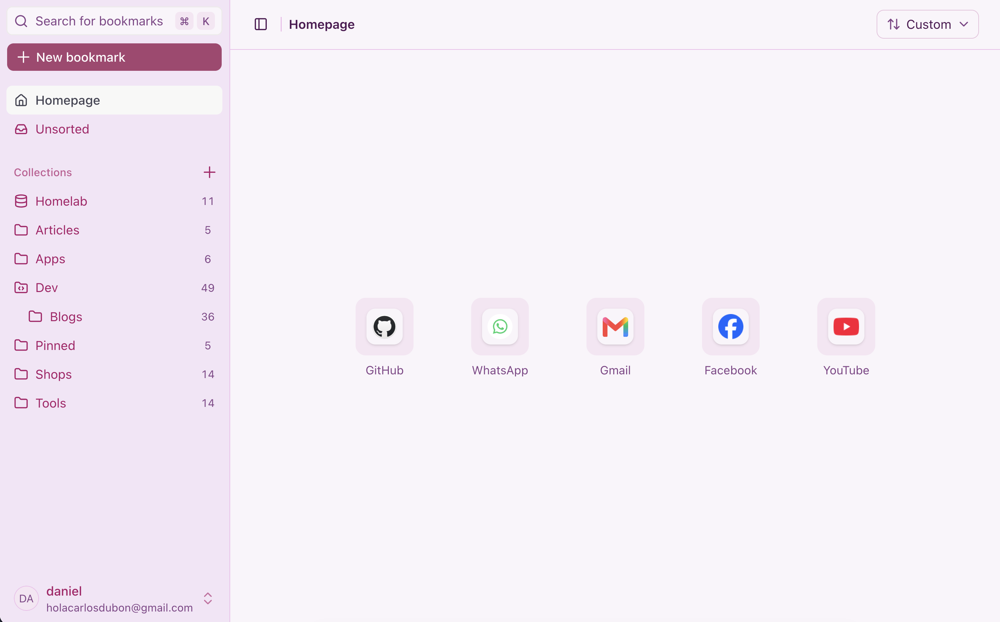
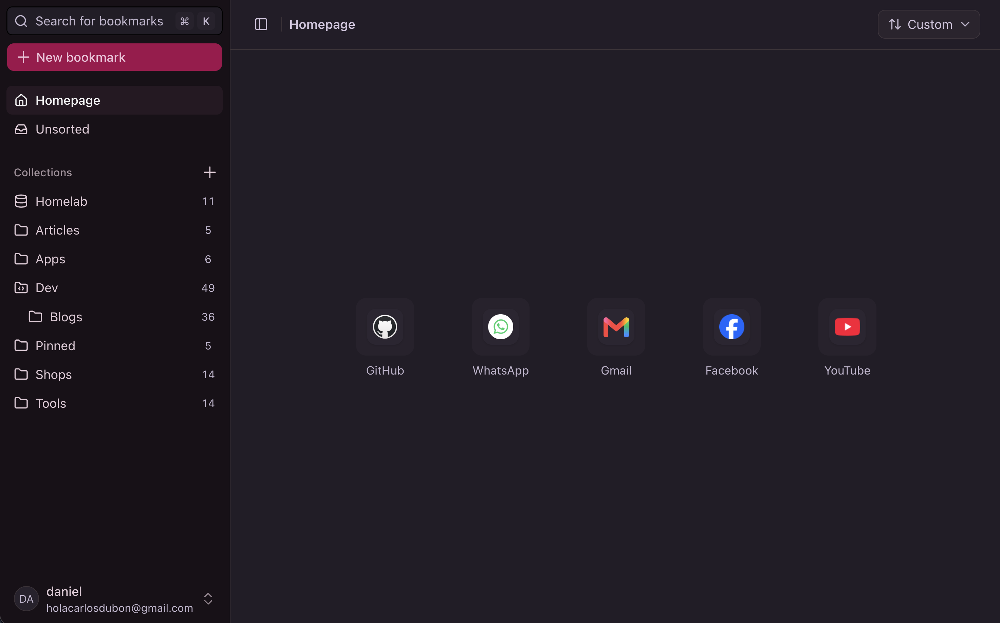
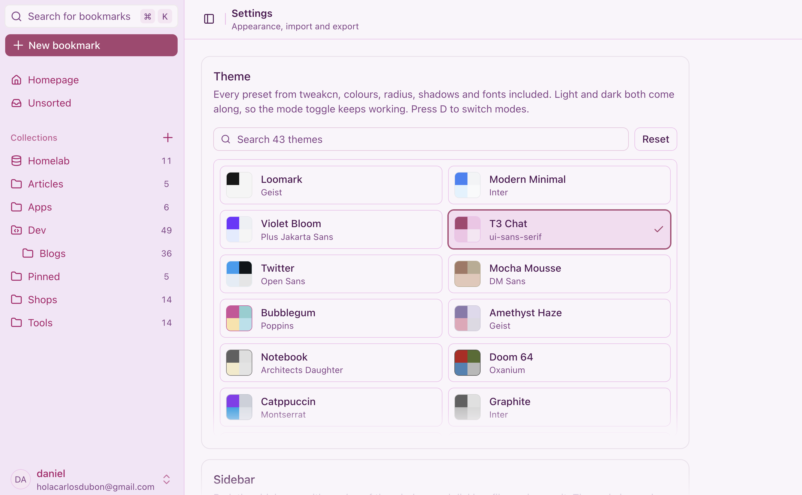

<p align="center">
  
</p>

<h1 align="center">Loomark</h1>

<p align="center">
  <b>A modern self-hosted bookmark manager.</b><br>
  Runs on your server. Looks good doing it.
</p>

<p align="center">
  
</p>

---

I built Loomark to be the bookmark manager I'd actually open every day. Quick to search, easy on the eyes, and running on my own server.

- Pinned sites on the homepage, collections nested as deep as you want, grid or list
- Search on `⌘K` across titles, URLs and descriptions
- 43 [tweakcn](https://tweakcn.com) themes, light and dark. Press `D` to switch
- A browser extension for Chrome and Firefox, plus a New Tab build
- Two-way browser sync through [floccus](https://floccus.org)
- Import from any browser or from [Linkwarden](https://linkwarden.app), export the same way
- Read-only share links for any collection
- Optional page archiving: screenshot, HTML, PDF, markdown
- Installable as a PWA

<p align="center">
  
  
</p>

## Install

Docker, and something to leave it running on.

```bash
mkdir loomark && cd loomark
curl -O https://raw.githubusercontent.com/carlos-dubon/loomark/main/docker-compose.yml
curl -o .env https://raw.githubusercontent.com/carlos-dubon/loomark/main/.env.example
```

Set `AUTH_SECRET` in `.env` to the output of `openssl rand -base64 32`. If you'll reach Loomark at anything other than `http://localhost:3000`, set `AUTH_URL` too.

```bash
docker compose up -d
```

The first account you create is the owner. Make it, then set `ALLOW_REGISTRATION=false` and run `docker compose up -d` again.

## Extension

No store listing yet, so you sideload it from the [latest release](https://github.com/carlos-dubon/loomark/releases/latest).

**Chromium** (Chrome, Edge, Brave, Arc): unzip `loomark-extension-<version>-chrome.zip`, then load the folder at `chrome://extensions` with developer mode on.

**Firefox** 127+: load `loomark-extension-<version>-firefox.zip` at `about:debugging#/runtime/this-firefox` as a temporary add-on. Firefox drops it on restart.

The popup asks for your server URL and password on first run, then trades the password for an API token. After that it's one click to save, and the popup opens in edit mode on pages you've already saved.

There's also a **New Tab** build (`loomark-extension-newtab-<version>-*.zip`) that points your new tab at Loomark, for browsers that can't do it in their own settings. Install one or the other, not both.

## Browser sync

[floccus](https://floccus.org) syncs your browser's native bookmarks against a backend, and Loomark speaks the API it needs.

Install floccus ([Chrome](https://chromewebstore.google.com/detail/floccus-bookmarks-sync/fnaicdffflnofjppbagibeoednhnbjhg), [Firefox](https://addons.mozilla.org/en-US/firefox/addon/floccus/), [Edge](https://microsoftedge.microsoft.com/addons/detail/floccus-bookmarks-sync/gjkddcofhiifldbllobcamllmanombji)), add an account of type **Nextcloud Bookmarks**, enter your Loomark URL, and run the login flow.

Then set the sync targets:

| Field             | What to put                                                                            |
| ----------------- | -------------------------------------------------------------------------------------- |
| **Server target** | Empty for the top of your library, or a path like `/Browser` to scope it               |
| **Local target**  | A **new, empty** bookmarks folder. floccus merges anything already in there, both ways |

Descriptions and preview images stay on the Loomark side, and only `http` and `https` bookmarks sync.

## Updating

```bash
docker compose pull && docker compose up -d
```

Migrations run on start, so any version catches up in one step. To take a database dump first:

```bash
curl -O https://raw.githubusercontent.com/carlos-dubon/loomark/main/apps/web/scripts/upgrade.sh
chmod +x upgrade.sh && ./upgrade.sh
```

You track `latest` by default. Pin with `LOOMARK_VERSION="0.1.0"` in `.env`.

## Config

| Variable                                          |              |                                        |
| ------------------------------------------------- | ------------ | -------------------------------------- |
| `AUTH_SECRET`                                     | **required** | Session encryption key                 |
| `AUTH_URL`                                        | **required** | Public origin of your instance         |
| `LOOMARK_VERSION`                                 | optional     | Image tag to run, defaults to `latest` |
| `ALLOW_REGISTRATION`                              | optional     | `false` closes signups                 |
| `APP_PORT`                                        | optional     | Host port, defaults to `3000`          |
| `POSTGRES_USER` `POSTGRES_PASSWORD` `POSTGRES_DB` | optional     | Database credentials                   |

Archives live on disk in the `loomark-archives` volume, so keep an eye on space.

## Shortcuts

| Key             |                  |
| --------------- | ---------------- |
| `⌘K` / `Ctrl+K` | Search           |
| `⌘B` / `Ctrl+B` | Toggle sidebar   |
| `D`             | Toggle dark mode |
| `Esc`           | Clear selection  |

## Development

Node 24, pnpm, Docker.

```bash
git clone https://github.com/carlos-dubon/loomark.git && cd loomark
cp .env.example .env
pnpm install
docker compose up -d db
pnpm run db:migrate
pnpm run dev
```

`pnpm run ext:dev` runs the extension with hot reload. `ext:build` and `ext:build:firefox` produce loadable folders in `apps/extension/output/`. Append `:newtab` for the New Tab variant.

---

[MIT](LICENSE)
