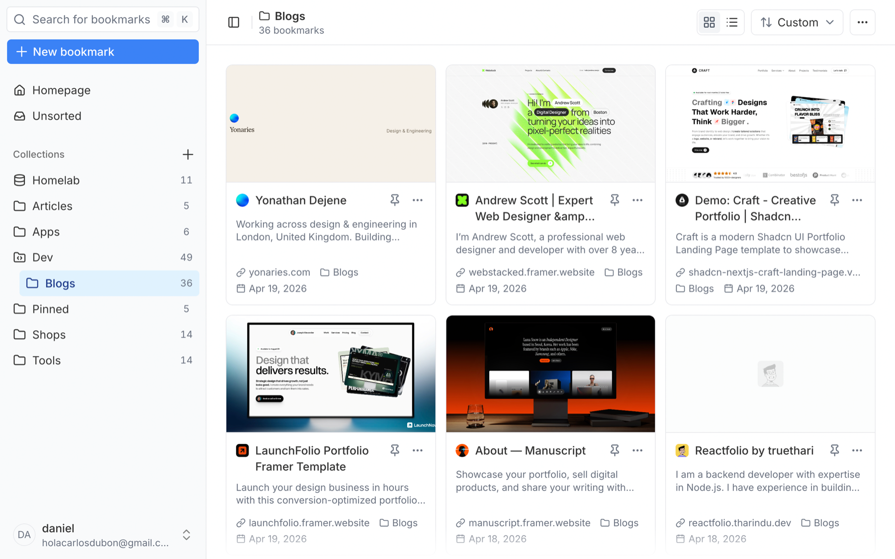

<p align="center">
  
</p>

<h1 align="center">Loomark</h1>

<p align="center">
  <b>A modern self-hosted bookmark manager built with shadcn.</b>
</p>

<p align="center">
  
</p>

- Pinned sites in the homepage
- Search your bookmarks with `⌘K`
- [tweakcn](https://tweakcn.com) themes, light and dark. Press `D` to switch
- A browser extension for Chromium based browsers and Firefox
- Import from any browser or from [Linkwarden](https://linkwarden.app)
- Share links for any collection
- Page archiving: screenshot, HTML, PDF, markdown
- Installable as a PWA

## Install

Docker

```bash
mkdir loomark && cd loomark
curl -O https://raw.githubusercontent.com/carlos-dubon/loomark/main/docker-compose.yml
curl -o .env https://raw.githubusercontent.com/carlos-dubon/loomark/main/.env.example
```

Set `AUTH_SECRET` in `.env` to the output of `openssl rand -base64 32`. If you'll reach Loomark at anything other than `http://localhost:3000`, set `AUTH_URL` too.

```bash
docker compose up -d
```

The first account you create is the owner.

## Extension

No store listing yet, so you sideload it from the [latest release](https://github.com/carlos-dubon/loomark/releases/latest).

**Chromium**: unzip `loomark-extension-<version>-chrome.zip`, then load the folder at `chrome://extensions` with developer mode on.

**Firefox**: load `loomark-extension-<version>-firefox.zip` at `about:debugging#/runtime/this-firefox` as a temporary add-on.

## Updating

```bash
docker compose pull && docker compose up -d
```

## Config

| Variable                                          |              |                                        |
| ------------------------------------------------- | ------------ | -------------------------------------- |
| `AUTH_SECRET`                                     | **required** | Session encryption key                 |
| `AUTH_URL`                                        | **required** | Public origin of your instance         |
| `LOOMARK_VERSION`                                 | optional     | Image tag to run, defaults to `latest` |
| `ALLOW_REGISTRATION`                              | optional     | `false` closes signups                 |
| `APP_PORT`                                        | optional     | Host port, defaults to `3000`          |
| `POSTGRES_USER` `POSTGRES_PASSWORD` `POSTGRES_DB` | optional     | Database credentials                   |

Archives live on disk in the `loomark-archives` volume, so keep an eye on space.

## Keyboard shortcuts

| Key             |                  |
| --------------- | ---------------- |
| `⌘K` / `Ctrl+K` | Search           |
| `⌘B` / `Ctrl+B` | Toggle sidebar   |
| `D`             | Toggle dark mode |
| `Esc`           | Clear selection  |

## Development

Node 24, pnpm, Docker.

```bash
git clone https://github.com/carlos-dubon/loomark.git && cd loomark
cp .env.example .env
pnpm install
docker compose up -d db
pnpm run db:migrate
pnpm run dev
```

## License

[MIT](LICENSE)
